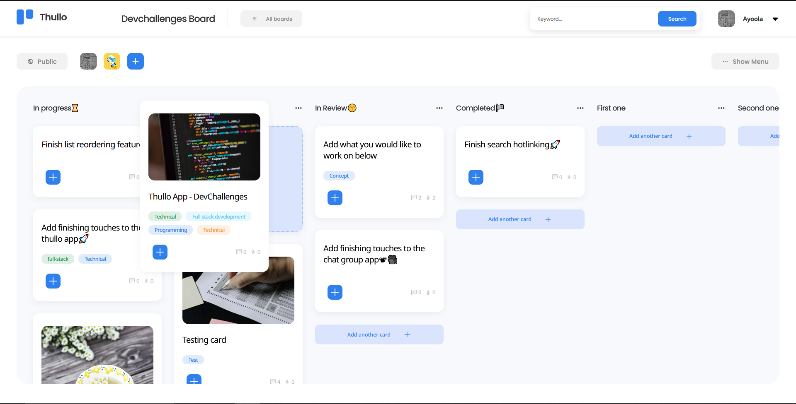
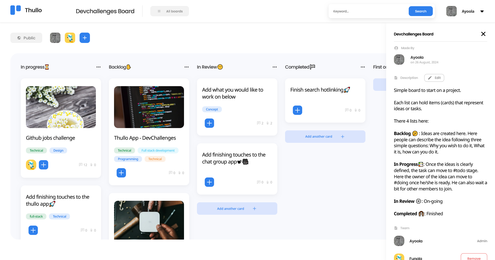
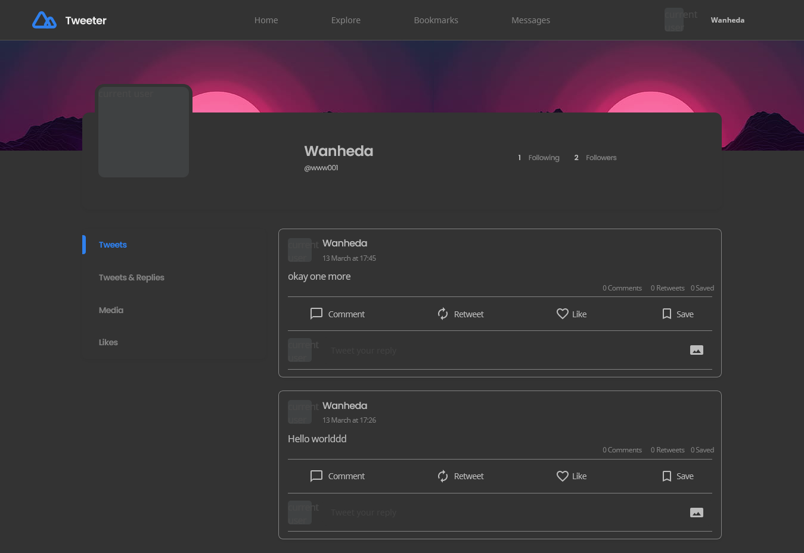
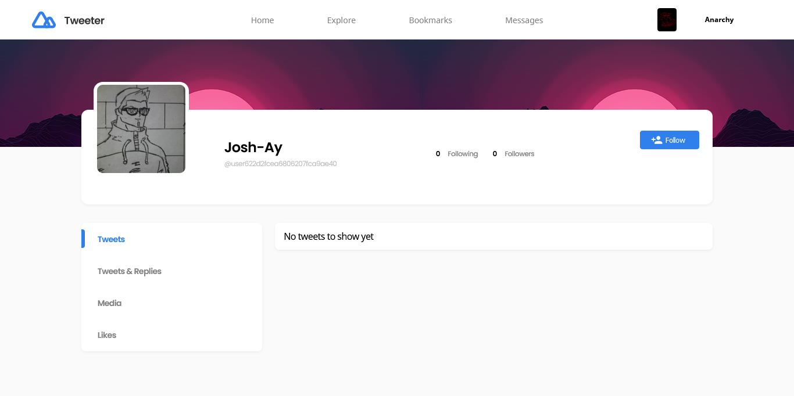
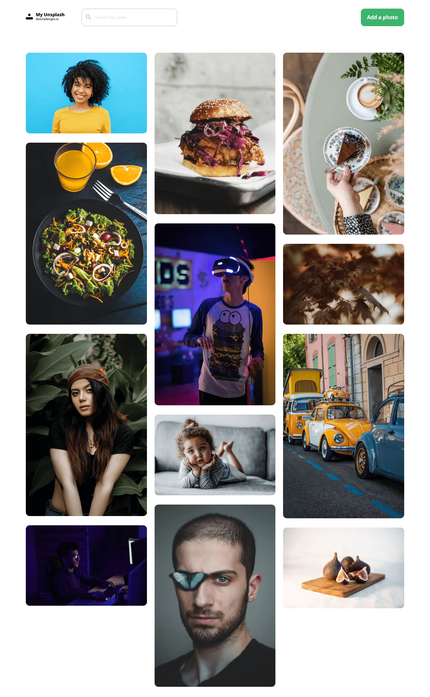

# A collection of web applications built using HTML/CSS, Flask, EJS, React, NextJS.

## List of Web Applications
- [Thullo App](#thullo-app)
- [Chat Group Application](#chat-group-application)
- [Twitter Clone](#twitter-clone)
- [Image Colour Palette Generator](#image-colour-palette-generator)
- [Unsplash Clone](#unsplash-clone)
- [To-Do Application](#to-do-application)
- [Cafe and Wifi Website](#cafe-and-wifi-website)
- [Blog Website](#blog-website)
- [Movie App](#movie-app)

### Thullo App
A web application clone of Trello built for visual collaboration and project management

- [Link to codebase](https://github.com/Josh-Ay/thullo)
- [Link to live site](https://thullo-silk.vercel.app)

### Chat Group Application
Chatting, Audio/Video calling on the blockchain in real-time.

- [Link to codebase](#chat-group-application)
- [Link to live site](#chat-group-application)

### Twitter Clone
A progressive web application clone of Twitter.

- [Link to codebase](https://github.com/Josh-Ay/twitter-clone)
- [Link to live site](https://tweeter-clone-app.netlify.app/)

### Image Colour Palette Generator
A web application that finds the most common colors in an uploaded image effectively creating a color palette for you. 

- [Link to codebase](https://github.com/Josh-Ay/image-colour-palette-generator)
- [Link to live site](https://image-color-app.onrender.com/)

### Unsplash Clone
A clone of unsplash website.

- Link to codebase
  1. [frontend](https://github.com/Josh-Ay/my-unsplash-clone)
  2. [backend](https://github.com/Josh-Ay/my-unsplash-clone-backend)
- [Link to live site](https://focused-bassi-b35684.netlify.app/)

### To-Do Application
A simple todo application.

- [Link to codebase](https://github.com/Josh-Ay/todo-app)
- [Link to live site](https://light-rose-calf.cyclic.app/)

### Cafe and Wifi Website
A simple website built with Flask that lists cafes with wifi and power for remote working.
- [Link to codebase](https://github.com/Josh-Ay/cafe-and-wifi-website)

### Movie App
A website that lists my top 10 movies built using Flask.
- [Link to codebase](https://github.com/Josh-Ay/movie-project)

### Blog Website
A simple blog built using Flask
- [Link to codebase](https://github.com/Josh-Ay/sample-blog-website)

